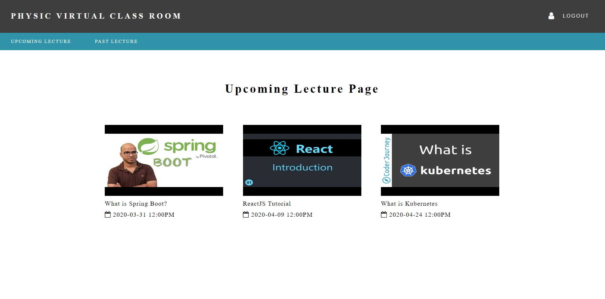

# Virtual Classroom Page

## Purpose
Each OSU student spends approximately $70,000 for learning materials. This project is the first step to provide free learning materials and platform for students. The virtual classroom page will replace the current online lecture pages. Lectures can be provided without using other companies.

## Tech Stack

* Java8
* Spring
* MySQL

## Note

* This project doesn't publish online. (we don't have any plan to publish this project) 
* To build and run this project must be preceded by appropriate database setup, which is provided in these [sql](/setup.sql) [files](dummy_data.sql)
* 
## File Manifest
* ServerSide Controller(JAVA) - /physicsLecturePage/physics/src/main/java/com/osu/lecture/
* Mapper - physicsLecturePage/physics/src/main/resources/mapper/
* ClientSide Controller(JavaScript) - physicsLecturePage/physics/src/main/webapp/resources/js/
* CSS - physicsLecturePage/physics/src/main/webapp/resources/css/
* Images - physicsLecturePage/physics/src/main/webapp/resources/images/
* View(JSP) - physicsLecturePage/physics/src/main/webapp/WEB-INF/views/

## Author
* Yeongae Lee - ambacc244@naver.com
* Jaehyung You - iamericyou@gmail.com
